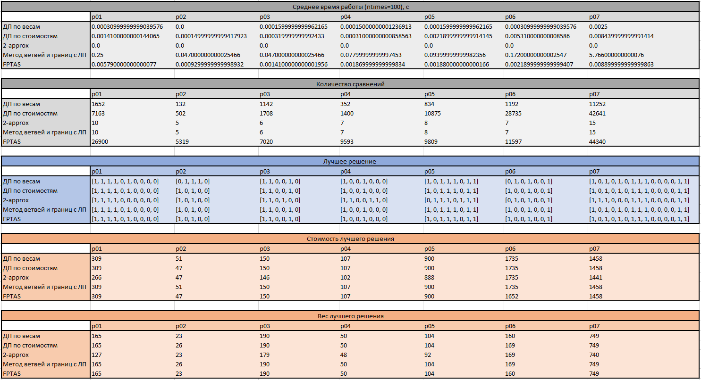

# Задача о рюкзаке

## Реализации

+ [Дп на весах](/lab_2/algorithms/weights_dp.py)
+ [Дп на стоимостях](/lab_2/algorithms/cost_dp.py)
+ [2-approx алгоритм](/lab_2/algorithms/approx2.py)
+ [ЛП метод ветвей и границ](/lab_2/algorithms/lp.py)
+ [FPTAS](/lab_2/algorithms/fptas.py)

## Результаты тестирования

+ Среднее время работы (ntimes=100), c

|--------------------------------------|--------------------------------|------------------------|-----------------------|------------------------|--------------------------|------------------------|-----------------------------------------------|
|                                      | p01                            | p02                    | p03                   | p04                    | p05                      | p06                    | p07                                           |
| ДП по весам                          | 0.00030999999999039576         | 0.0                    | 0.0001599999999962165 | 0.00015000000001236913 | 0.0001599999999962165    | 0.00030999999999039576 | 0.0025                                        |
| ДП по стоимостям                     | 0.0014100000000144065          | 0.00014999999999417923 | 0.000319999999992433  | 0.00031000000000858563 | 0.0021899999999914145    | 0.005310000000008586   | 0.008439999999991414                          |
| 2-approx                             | 0.0                            | 0.0                    | 0.0                   | 0.0                    | 0.0                      | 0.0                    | 0.0                                           |
| Метод ветвей и границ с ЛП           | 0.25                           | 0.047000000000025466   | 0.047000000000025466  | 0.07799999999997453    | 0.09399999999982356      | 0.17200000000002547    | 5.766000000000076                             |
| FPTAS                                | 0.005790000000000077           | 0.0009299999999998932  | 0.0014100000000001956 | 0.001869999999999834   | 0.001880000000000166     | 0.0021899999999999407  | 0.008899999999999863                          |
|                                      |                                |                        |                       |                        |                          |                        |                                               |

+ Количество сравнений

|--------------------------------------|--------------------------------|------------------------|-----------------------|------------------------|--------------------------|------------------------|-----------------------------------------------|
|                                      | p01                            | p02                    | p03                   | p04                    | p05                      | p06                    | p07                                           |
| ДП по весам                          | 1652                           | 132                    | 1142                  | 352                    | 834                      | 1192                   | 11252                                         |
| ДП по стоимостям                     | 7163                           | 502                    | 1708                  | 1400                   | 10875                    | 28735                  | 42641                                         |
| 2-approx                             | 10                             | 5                      | 6                     | 7                      | 8                        | 7                      | 15                                            |
| Метод ветвей и границ с ЛП           | 10                             | 5                      | 6                     | 7                      | 8                        | 7                      | 15                                            |
| FPTAS                                | 26900                          | 5319                   | 7020                  | 9593                   | 9809                     | 11597                  | 44340                                         |

+ Лучшее решение

|--------------------------------------|--------------------------------|------------------------|-----------------------|------------------------|--------------------------|------------------------|-----------------------------------------------|
|                                      | p01                            | p02                    | p03                   | p04                    | p05                      | p06                    | p07                                           |
| ДП по весам                          | [1, 1, 1, 1, 0, 1, 0, 0, 0, 0] | [0, 1, 1, 1, 0]        | [1, 1, 0, 0, 1, 0]    | [1, 0, 0, 1, 0, 0, 0]  | [1, 0, 1, 1, 1, 0, 1, 1] | [0, 1, 0, 1, 0, 0, 1]  | [1, 0, 1, 0, 1, 0, 1, 1, 1, 0, 0, 0, 0, 1, 1] |
| ДП по стоимостям                     | [1, 1, 1, 1, 0, 1, 0, 0, 0, 0] | [1, 0, 1, 0, 0]        | [1, 1, 0, 0, 1, 0]    | [1, 0, 0, 1, 0, 0, 0]  | [1, 0, 1, 1, 1, 0, 1, 1] | [1, 0, 0, 1, 0, 0, 1]  | [1, 0, 1, 0, 1, 0, 1, 1, 1, 0, 0, 0, 0, 1, 1] |
| 2-approx                             | [1, 1, 1, 1, 0, 0, 0, 0, 0, 0] | [1, 0, 1, 0, 0]        | [1, 1, 0, 1, 0, 0]    | [1, 1, 0, 0, 1, 1, 0]  | [0, 1, 1, 1, 0, 1, 1, 1] | [0, 1, 0, 1, 0, 0, 1]  | [1, 1, 1, 0, 0, 0, 1, 1, 1, 0, 0, 0, 0, 1, 1] |
| Метод ветвей и границ с ЛП           | [1, 1, 1, 1, 0, 1, 0, 0, 0, 0] | [1, 0, 1, 0, 0]        | [1, 1, 0, 0, 1, 0]    | [1, 0, 0, 1, 0, 0, 0]  | [1, 0, 1, 1, 1, 0, 1, 1] | [1, 0, 0, 1, 0, 0, 1]  | [1, 0, 1, 0, 1, 0, 1, 1, 1, 0, 0, 0, 0, 1, 1] |
| FPTAS                                | [1, 1, 1, 1, 0, 1, 0, 0, 0, 0] | [1, 0, 1, 0, 0]        | [1, 1, 0, 0, 1, 0]    | [1, 0, 0, 1, 0, 0, 0]  | [1, 0, 1, 1, 1, 0, 1, 1] | [1, 0, 0, 1, 0, 0, 1]  | [1, 0, 1, 0, 1, 0, 1, 1, 1, 0, 0, 0, 0, 1, 1] |

+ Стоимость лучшего решения

|--------------------------------------|--------------------------------|------------------------|-----------------------|------------------------|--------------------------|------------------------|-----------------------------------------------|
|                                      | p01                            | p02                    | p03                   | p04                    | p05                      | p06                    | p07                                           |
| Истинное решение                     | 309                            | 51                     | 150                   | 107                    | 900                      | 1735                   | 1458                                          |
| ДП по весам                          | 309                            | 51                     | 150                   | 107                    | 900                      | 1735                   | 1458                                          |
| ДП по стоимостям                     | 309                            | 47                     | 150                   | 107                    | 900                      | 1735                   | 1458                                          |
| 2-approx                             | 266                            | 47                     | 146                   | 102                    | 888                      | 1735                   | 1441                                          |
| Метод ветвей и границ с ЛП           | 309                            | 51                     | 150                   | 107                    | 900                      | 1735                   | 1458                                          |
| FPTAS                                | 309                            | 47                     | 150                   | 107                    | 900                      | 1652                   | 1458                                          |

+ Вес лучшего решения

|--------------------------------------|--------------------------------|------------------------|-----------------------|------------------------|--------------------------|------------------------|-----------------------------------------------|
|                                      | p01                            | p02                    | p03                   | p04                    | p05                      | p06                    | p07                                           |
| Истинный вес                         | 165                            | 26                     | 190                   | 50                     | 104                      | 169                    | 749                                           |
| ДП по весам                          | 165                            | 23                     | 190                   | 50                     | 104                      | 160                    | 749                                           |
| ДП по стоимостям                     | 165                            | 26                     | 190                   | 50                     | 104                      | 169                    | 749                                           |
| 2-approx                             | 127                            | 23                     | 179                   | 48                     | 92                       | 169                    | 740                                           |
| Метод ветвей и границ с ЛП           | 165                            | 26                     | 190                   | 50                     | 104                      | 169                    | 749                                           |
| FPTAS                                | 165                            | 23                     | 190                   | 50                     | 104                      | 160                    | 749                                           |

<!--  -->